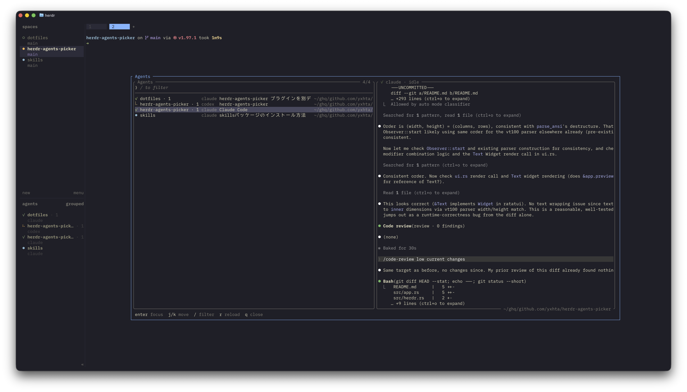

# agents-picker

Herdr plugin: a workspace-picker-style fuzzy picker for Herdr-detected agent
panes. Opens as a modal popup, filters as you type, previews the selected
agent's pane on the right, and focuses it on Enter. Rust + ratatui.



Each row shows the workspace and tab name exactly as the built-in sidebar's
"agents" panel does (no raw pane ids). If the picker is opened from inside an
agent session, that agent starts pre-selected.

## Install

```sh
herdr plugin install yxhta/herdr-agents-picker
```

Requires Herdr 0.7.2+ on macOS or Linux. The install step builds the plugin
from source (`cargo build --release --locked`), so a Rust toolchain is needed.

## Keys

Modal, matching the built-in workspace picker: navigate by default, `/` for
incremental search. `enter` focuses the selected agent and `ctrl+c` closes in
both modes.

Navigate mode:

| Key         | Action                    |
| ----------- | ------------------------- |
| `j` / `k`   | move selection            |
| `↑` / `↓`   | move selection            |
| `/`         | enter incremental search  |
| `r`         | reload the agent list now |
| `q` / `esc` | close without focusing    |

Search mode:

| Key                 | Action                            |
| ------------------- | --------------------------------- |
| type                | fuzzy-filter agents incrementally |
| `esc`               | cancel search (clears the filter) |
| `↑` / `↓`           | move selection                    |
| `ctrl+k` / `ctrl+j` | move selection                    |
| `ctrl+p` / `ctrl+n` | move selection                    |
| `ctrl+r`            | reload the agent list now         |
| `ctrl+u`            | clear the filter                  |
| `ctrl+w`            | delete the last word              |

The agent list refreshes every 2s. The selected agent's preview follows its
live terminal stream and normally appears within the TUI's 100ms redraw
cadence. If the stream is unavailable, the picker falls back to a 1s snapshot
refresh and retries the stream with bounded exponential backoff. A low-frequency
5s snapshot also guards against a stream that stays open but stops producing
frames; stream errors are shown in the footer.

The default list order mirrors Herdr's built-in Agents sidebar and follows
`ui.agent_panel_sort`: `spaces` keeps workspace/tab/pane grouping, while
`priority` orders agents by attention (`blocked`, `done`, `working`, `idle`,
then `unknown`). Within the same state, the plugin records Herdr status-change
events and shows the most recently changed agent first. Configuration changes
are picked up on the next list refresh.

## UI

The status column mirrors Herdr's built-in Agents sidebar: braille spinner
(yellow) = working, `◉` (red) = blocked, `●` (teal) = done, `✓` (green) = idle,
and `○` (dim) = unknown. While searching, fuzzy-matched characters are
highlighted in the list.

## Setup (local checkout)

For development, link a local checkout instead of installing. Build first:

```sh
cargo build --release
```

If you use [mise](https://mise.jdx.dev/), `mise install` provides the Rust
toolchain declared in `mise.toml`.

Link into Herdr once (one-time, like `mise trust`):

```sh
herdr plugin link "$PWD"
```

Keybinding in herdr's `config.toml` (e.g. `prefix+f`):

```toml
[[keys.command]]
key = "prefix+f"
type = "plugin_action"
command = "yxhta.agents-picker.open"
description = "agents picker"
```

Manual open without the keybinding:

```sh
herdr plugin pane open --plugin yxhta.agents-picker --entrypoint picker
```

## How it works

- `herdr-plugin.toml` declares a `popup` pane (`picker`) running the TUI and an
  action (`open`) that opens that pane, so a `plugin_action` keybinding works.
- The TUI talks to the running Herdr instance through the CLI at
  `HERDR_BIN_PATH`: `agent list` for rows, `workspace list` + `tab list` to
  resolve each row's workspace/tab name, `terminal session observe` for the
  live preview, and `agent focus` on Enter (issued after the TUI exits, before
  the process ends). `agent read` is the preview fallback.
- Live ANSI frames are decoded on a reader thread into a bounded in-memory
  terminal screen. Foreground/background colors and text modifiers are
  preserved in both live and fallback previews. The TUI renders only the newest
  screen state, so fast agent output cannot build an unbounded update queue.
- Focus targets prefer `terminal_id` over `pane_id` because pane ids compact
  when panes close.
- The workspace/tab label mirrors the built-in sidebar's default agent row:
  workspace name, plus the tab name only when the workspace has more than one
  tab or the tab was given a custom (non-numeric) name.

## Development

```sh
cargo test
cargo clippy --all-targets
cargo fmt
```

The `[[build]]` command in the manifest only runs on `herdr plugin install`
from GitHub; linked checkouts build manually as above.

## License

[MIT](LICENSE)
